# 1 D Elasto-plastic problem

Consider a prismatic elasto-plastic bar subjected to cyclic axial loading. The axial
strain in the bar is given by $\epsilon$ = 0.002 sin 2πt. The plastic strain $\epsilon^p$ in the bar is
zero initially. Use the return mapping algorithm discussed in class to compute and
plot: (i) the stress $\sigma$ in the bar as a function of time, (ii) plastic strain as a function
of time, (iii) stress as a function of strain and (iv) energy dissipated per cycle as a
function of number of cycles. Do this up to time t = 10 units and for the following
cases.

  a) Elastic perfectly plastic bar with Young’s modulus E and yield strength $\sigma_{y0}$.
  
  b) Elasto-plastic bar with linear kinematic hardening: Young’s modulus E, yield stress $\sigma_{y0}$ and tangent modulus $E_t$ = 0.2E in the plastic regime.
  
  c) Elasto-plastic bar with linear isotropic hardening: Young’s modulus E and yield strength $\sigma_{y}$ = $\sigma_{y0}$ + 0.2Es, where s is the plastic arc length whose evolution is given by the differential equation $\dot{s}$ = $|\dot{\epsilon^p}|$.

Choose any suitable value for E and assume $\sigma_{y0}$ = $10^{−3}$ E.

## Solution
Considering E=200 and defining 1000 time steps between t=0 to t=10.

  a) For a perfectly plastic bar, following plots are obtained:
  
  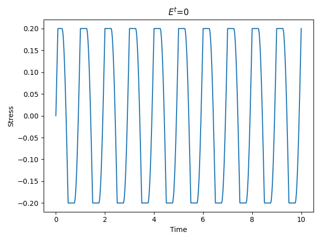 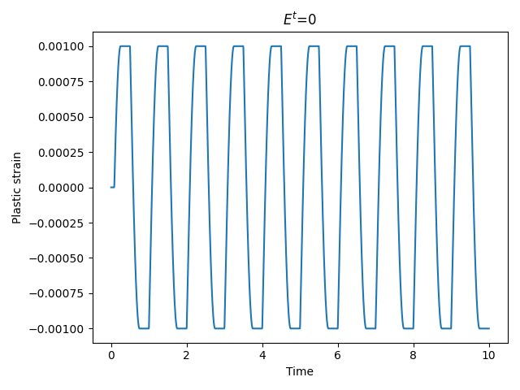
  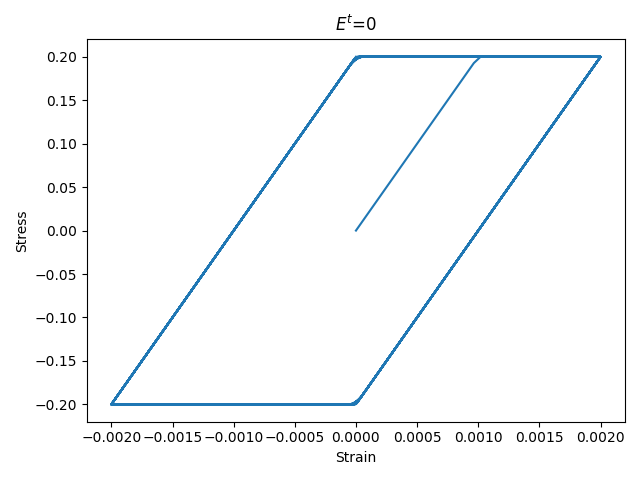 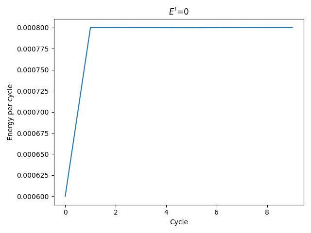

  b) For a bar with kinematic hardening, having tangent modulus $E_t$ = 0.2E, we derive the kinematic hardening coefficient, K=0.25E. Thus following plots are obtained:
  
  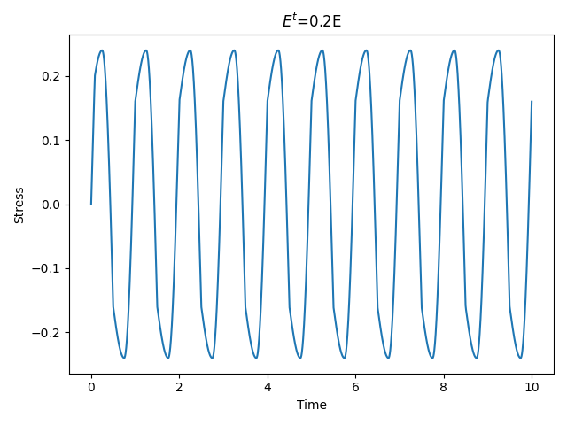 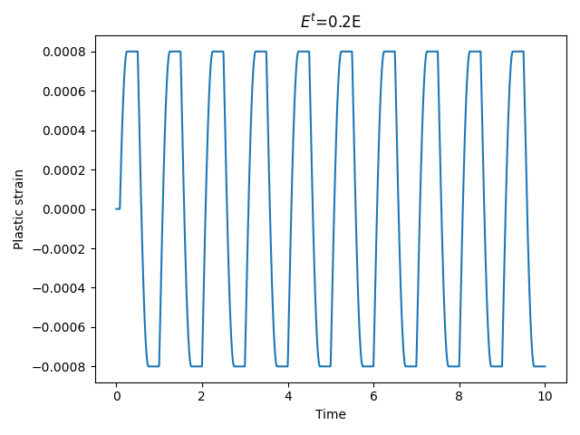
  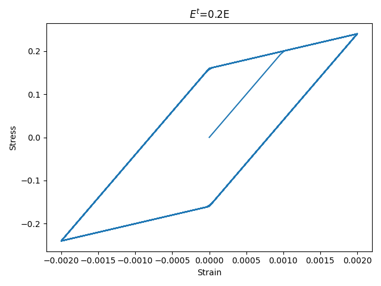 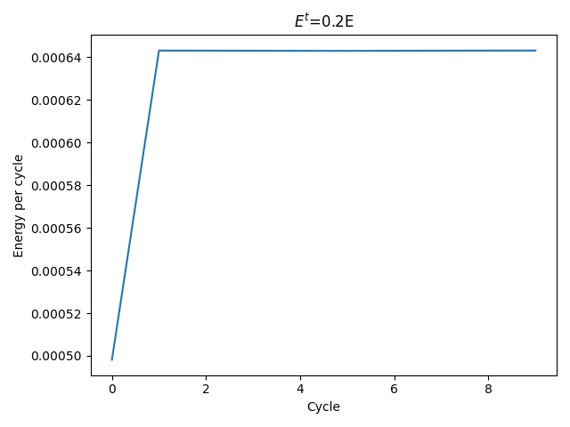
  
  c) For a bar with linear isotropic hardening, following plots are obtained:
  
  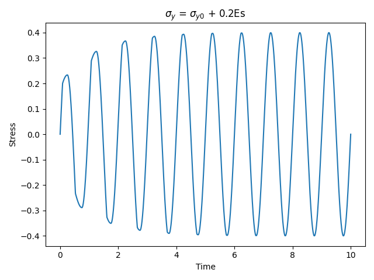 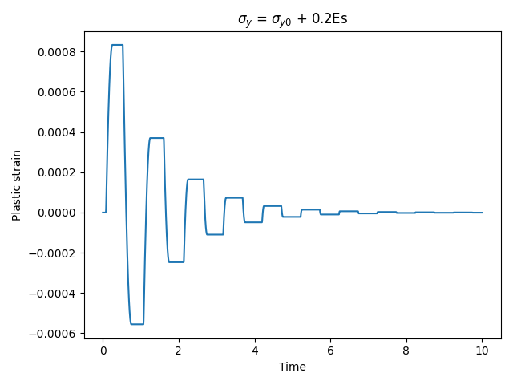
  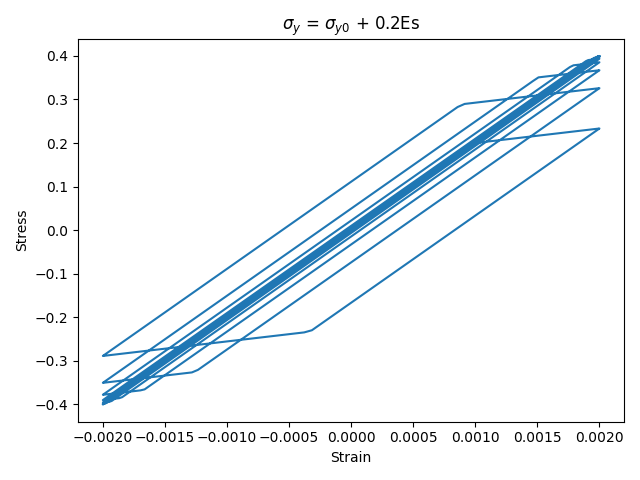 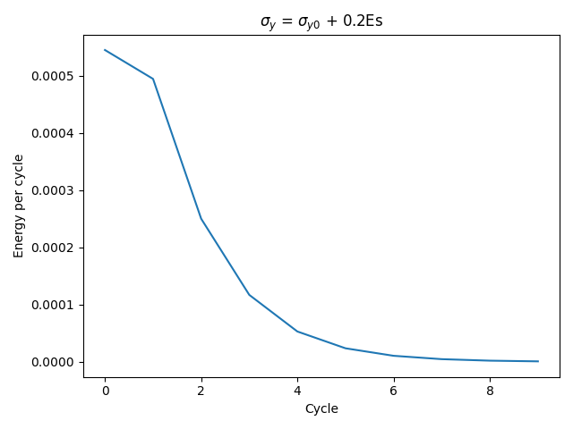
